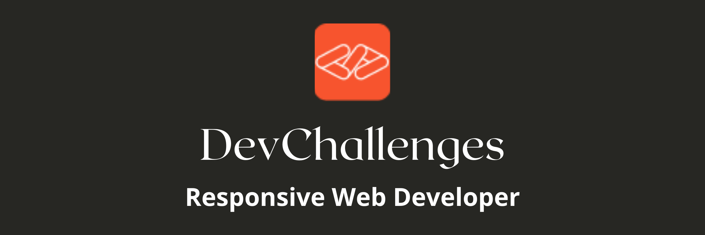
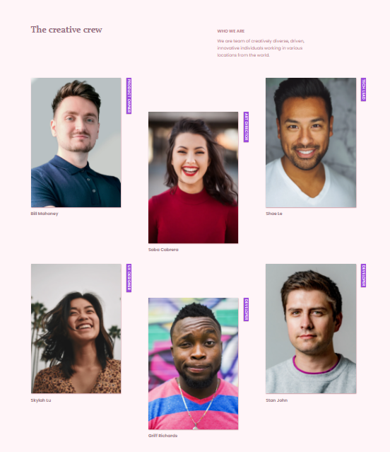

<h1 align="center">{My Team Page}</h1>

   Solution for a challenge from  <a href="http://devchallenges.io" target="_blank">Devchallenges.io</a>.

  <h3>
    <a href="https://my-team-page-xi.vercel.app/">
      Demo
    </a>
     | 
    <a href="">
      Solution
    </a>
     | 
    <a href="https://devchallenges.io/challenges/hhmesazsqgKXrTkYkt0U">
      Challenge
    </a>
  </h3>

<!-- TABLE OF CONTENTS -->

## Table of Contents

- [Overview](#overview)
  - [Built With](#built-with)
- [Features](#features)
- [Contact](#contact)

<!-- OVERVIEW -->

## Overview

- You can see the demo at [My Team Page](https://my-team-page-xi.vercel.app/)
- Happy to work with grid. I've learned new css properties. I hope to continue improving my skills.

### Built With

- [Sass](https://sass-lang.com/)

## Features

This application/site was created as a submission to a [DevChallenges](https://devchallenges.io/paths/responsive-web-developer) challenge. The [challenge](https://devchallenges.io/challenges/hhmesazsqgKXrTkYkt0U) was to build an application to complete the given user stories.

- User story: I can see a page following the given design.

## Contact

- GitHub [@Aman-sgz](https://github.com/Aman-sgz)
- Twitter [@Aman_arg](https://twitter.com/Aman_arg)
---

  
Aman-sgz | 2021

